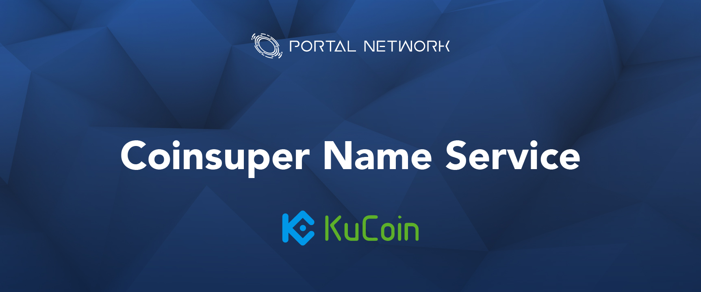

> 📖🔍 Documents of the KuCoin Name Service.

## 💡 What is KuCoin?
KuCoin is a crypto asset exchange and focus on crypto-to-crypto trading.

## 💡 What is KCS?
KuCoin Shares (KCS) is a proprietary token for the KuCoin crypto asset exchange, it is only tradeable on the KuCoin platform. It can be traded for ETH, BTC, USDT, NEO, DRGN, LTC, and other popular crypto assets. The token rewards holders by paying them a portion of exchange fees.

## 💡 What is BNS?
BNS – or blockchain name system – is the protocol on the internet that turns human-comprehensible decentralized website names such as 'website.mith' or 'mywebsite.eth' into addresses understandable by decentralized network machines.

## 💡 What is KNS?
KNS stand for KuCoin Name Service, is a protocol implemented on Ethereum blockchain infrastructure aimed to enhance and create communications across different protocols.  
KNS can direct communication between blockchain-dependent services. ie., wallets, smart contracts, and ÐWeb.  
KNS is an unique naming service to provide universal reference among all supported blockchains. With the two core services enabled, separated blockchains can finally be considered as a whole entity rather than an ecosystem consists of independent service clusters.

## 📚 Documents

#### Table of Contents
-  [Introduction](./docs/INTRODUCTION.md)

## 🔗 Links
- [Official Website](https://www.kucoin.com/#/)

## 📣 Contributing
See [CONTRIBUTING.md](./CONTRIBUTING.md) for how to help out.

## 🗒 Licence
See [LICENSE](./LICENSE) for details.
